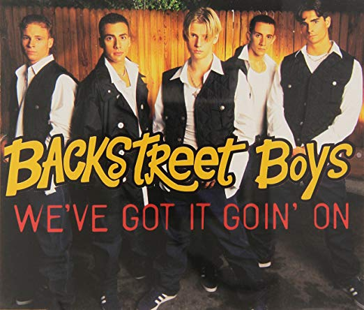
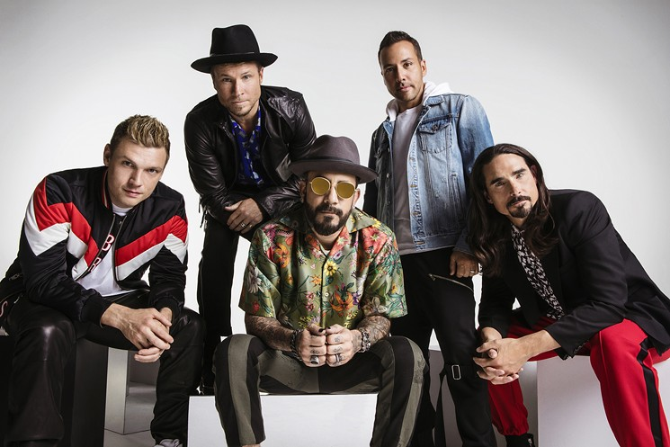

<center>


</center>

<br>

~~~~~~~~~~~~~~~~~~~~~~~~~~~~~~~~~~~~~~~~~~~~~~~~~~~~~~~~~~~~~~~~~~~~~~~~~~~~~~~~~~~~~~~~~~~~~~~~~~~~~~~~~~~~~~~~~~~~~~~~~~~~~~~~~~~~
Did you know that Backstreet Boys (often abbreviated as BSB) are an American vocal group, formed in Orlando, Florida in 1993. The group consists of `AJ McLean`, `Howie Dorough`, `Nick Carter`, `Kevin Richardson`, and `Brian Littrell`.

The group rose to fame with their debut international album, Backstreet Boys (1996). In the following year, they released their second international album Backstreet's Back (1997) along with their self-titled U.S. debut album, which continued the group's success worldwide. They rose to superstardom with their third studio album Millennium (1999) and its follow-up album, Black & Blue (2000).

After a two-year hiatus, they regrouped and released a comeback album Never Gone (2005). After the conclusion of the Never Gone Tour in 2006, Richardson left the group to pursue other interests. The group then released two albums as a quartet: Unbreakable (2007) and This Is Us (2009).

In 2012, the group announced that Richardson had rejoined them permanently.In the following year, they celebrated their 20th anniversary and released their first independent album, In a World Like This (2013). The group also released their first documentary movie, titled Backstreet Boys: Show 'Em What You're Made Of in January 2015.

The Backstreet Boys have sold over `100 million records` worldwide, making them the `best-selling boy band of all time`, and `one of the world's best-selling music artists`. They are the first group since Led Zeppelin to have their first ten albums reach the top 10 on the Billboard 200, and the only boy band to do so.

The Backstreet Boys are one of the few boy bands to have continued success long after their peak. Their 2019 album DNA debuted at number one, more than two decades after the group formed. In doing so they have achieved numerous milestones, including the third longest gap between number one albums on the Billboard 200 chart, at over 19 years, surpassed by Paul McCartney's 36-year gap and Santana's 28-year gap, and being the first boy band to top the U.S. charts in three different decades.[9] The group received a star on the Hollywood Walk of Fame on April 22, 2013.[10]

[Ref](https://en.wikipedia.org/wiki/Backstreet_Boys) 
~~~~~~~~~~~~~~~~~~~~~~~~~~~~~~~~~~~~~~~~~~~~~~~~~~~~~~~~~~~~~~~~~~~~~~~~~~~~~~~~~~~~~~~~~~~~~~~~~~~~~~~~~~~~~~~~~~~~~~~~~~~~~~~~~~~~

<br>

#### Our goal is to first perform exploratory analysis and then move to text mining including sentiment analysis which involves Natural Language Processing.

#### Exploratory analysis

+ word counts based on tracks and albums
+ time series analysis of word counts
+ distribution of word counts

#### Text mining

+ word cloud
+ topic modeling
+ sentiment analysis (includes chord diagram)

#### About datasets: 

+ "lyrics.csv" is a filtered corpus of 380,000+ song lyrics from from MetroLyrics. You can read more about it on [Kaggle](https://www.kaggle.com/gyani95/380000-lyrics-from-metrolyrics). 

 + "artists.csv" provides the background information of all the artistis. These information are scraped from [LyricsFreak](https://www.lyricsfreak.com/).


```{r setup, include=FALSE}
knitr::opts_chunk$set(echo = TRUE)
```


Let’s first find out the top 10 songs with the most number of words. The code snippet given below includes the packages required in this analysis and finds out the top songs in terms of length.

```{r load packages, message=FALSE, warning=FALSE,echo=FALSE}
packages.used=c("magrittr", "sentimentr", "stringr","dplyr","ggplot2","tm","wordcloud","tidytext","tidyr","igraph","ggraph","readr","circlize","reshape2","topicmodels")

# check packages that need to be installed.
packages.needed=setdiff(packages.used, 
                        intersect(installed.packages()[,1], 
                                  packages.used))
# install additional packages
if(length(packages.needed)>0){
  install.packages(packages.needed, dependencies = TRUE)
}
# load packages
library(magrittr)
library(stringr)
library(dplyr)
library(ggplot2)
library(tm)
library(wordcloud)
library(syuzhet)
library(tidytext)
library(tidyr)
library(igraph)
library(ggraph)
library(sentimentr)
library(readr)
library(circlize)
library(reshape2)
library(topicmodels)
```

<br>

This report is prepared with the following environmental settings.

```{r}
print(R.version)
```

<br>

Step 1 - Load the processed text data along with artist csv dataset

```{r load processed dataset, message=FALSE}
# We use the processed data for our analysis
load('../output/processed_lyrics.RData') 
# load artist information
dt_artist <- read_csv('../data/artists.csv') 

# Pick preferred artist from Artist dataset and lookup dataset from lyrics dataset
# We select a subset of the data that satisfies analysis objective.
lyrics <- dt_lyrics[dt_lyrics$artist == "backstreet-boys",]
```

<br>

#### Exploratory analysis

Question 1: BSB is such a classic and old boy band, what's the secret for their success and gained such large fans base worldwide, is it because of how they wrote songs or because of their physical appearance?

For me, I love BSB because their songs are so touching and emotion. With reasonable lyrics words, plus their emotion express inside the song have provided a different kind of listening experience compare to other well-known artist.


```{r, warning = FALSE}
# check how many charters for each lyrics text
lyrics$length <- str_count(lyrics$lyrics,"\\S+") 

# generate summary of number of song with its revelent words in each song
length_df <- lyrics %>% 
             group_by(song) %>% 
             summarise(length = sum(length))

# visualize top 
length_df %>% 
  arrange(desc(length)) %>%
  slice(1:10) %>%
  ggplot(., aes(x= reorder(song, -length), y=length)) +
  geom_bar(stat='identity', fill="#1CCCC6") + 
  ylab("Word count") + xlab ("Track title") + 
  ggtitle("Top 10 songs in terms of word count") + 
  theme_minimal() + 
  scale_x_discrete(labels = function(labels) {
    sapply(seq_along(labels), function(i) paste0(ifelse(i %% 2 == 0, '', '\n'), labels[i]))
  })


lyrics[lyrics$song == "set-it-off",c(1,2,3)]
```

Here are the Top 10 songs in terms of work count, and We can see that `set it off` (released in their 2007 album) is the song with maximum number of words and next in line is “over her” and rest are pretty much having equal number of words, can possible explain why people love their songs, familiarity and relationship bound. People tend to stay with what they are familiar and what they love. 

<br>

Now, how about the songs with the lowest number of words? Let’s find out using the following code:

```{r, warning = FALSE}
length_df %>% 
  arrange(length) %>%
  slice(1:10) %>%
  ggplot(., aes(x= reorder(song, length), y=length)) +
  geom_bar(stat='identity', fill="#1CCCC6") + 
  ylab("Word count") + xlab ("Track title") + 
  ggtitle("10 songs with least number of word count") + 
  theme_minimal() + 
  scale_x_discrete(labels = function(labels) {
    sapply(seq_along(labels), function(i) paste0(ifelse(i %% 2 == 0, '', '\n'), labels[i]))
  })

lyrics[lyrics$song == "betcha-by-golly-wow",c(1,2,3)]
```

`betcha-by-golly-wow` song which was released in 2006 is the song with least number of words. As you can see the number of words remain relevant, which once again explains number of words retain un-flatulated. 

<br>

The next analysis is centered around the distribution of the number of words.

```{r, warning = FALSE}
ggplot(length_df, aes(x=length)) + 
  geom_histogram(bins=30,aes(fill = ..count..)) + 
  geom_vline(aes(xintercept=mean(length)),
             color="#FFFFFF", linetype="dashed", size=1) +
  geom_density(aes(y=25 * ..count..),alpha=.2, fill="#1CCCC6") +
  ylab("Count") + xlab ("Legth") + 
  ggtitle("Distribution of word count") + 
  theme_minimal()
```

The average word count for the song stands close to 300, and chart shows that maximum number of songs fall in between 250 to 330 words.

```{r}
# load subset of dataset for Pop artisist for benchmark
pop_lyrics <- dt_lyrics[dt_lyrics$genre == "Pop",]

# all artist words distribution
pop_lyrics$length <- str_count(pop_lyrics$lyrics,"\\S+") 

all_pop_artist_words_length <- pop_lyrics %>% 
             group_by(artist) %>% 
             summarise(length = average_mean(length))

# within all pop artists, the average words count for all their songs
all_pop_artist_words_length %>% summarise(pop_length = average_mean(length))
```

As you can see, the average words count if roughly 248 which is matching with industry standard when compare with average lyrics words other pop artists have used, which is also `248`, so this can be another indicator that BSB is populate because they know how to attract audience's attention by limiting number of words they use inside their songs.

<br>

Now, we’ll move to the analysis based on year. 

```{r, warning = FALSE}
# We first create a data frame with word counts based on year of release.
lyrics %>% 
group_by(year) %>% 
summarise(length = sum(length)) -> length_df_year

# Then we create a chart that will depict the year based on cumulative word count of the songs.
length_df_year %>% 
arrange(desc(year)) %>%
ggplot(aes(x= reorder(year, -length), y=length)) +
geom_bar(stat='identity', fill="#1CCCC6") + 
ylab("Word count") + xlab ("") + 
ggtitle("Word count change over years") + 
theme_minimal()
```

The chart shows the number of songs that backstreet boys released in 2006 has the maximum number of words, and this tread has been decrease over the years from close 30000 words in `2006` to less than 2000 in 2016.


But, is that because of the number of words in individual song? Let’s find out:

```{r, warning = FALSE}
#adding year column by matching song
length_df$year <- lyrics$year[match(length_df$song, lyrics$song)] 

length_df %>% 
 group_by(year) %>% 
 summarise(length = mean(length)) %>%
   ggplot(., aes(x= factor(year), y=length, group = 1)) +
   geom_line(colour="#1CCCC6", size=1) + 
   ylab("Average word count") + xlab ("Year") + 
   ggtitle("Year-wise average Word count change") + 
   theme_minimal()   
```

The chart confirms that the average word count was increased for few years, then decreased significantly since 2011 (from 275 in 2006 to 375 in 2011, then from 380 to 200 words in 2014), i.e., this drop likely due to aging from the group memebers and focus more time on family and tours rather than writing new songs.

<br>

#### Text mining

Question 2: Can Backstreet boys’ song warm your heat during winter, downtime, or when someone is depressed. Any indicator to give people hope remind them what is love feeling like?

First, I would be to create a word cloud so that we can visualize the frequently of used words in their lyrics.

```{r, warning = FALSE}
#prepare to analysis text
lyrics_text <- lyrics$lyrics

#Removing punctations and alphanumeric content
lyrics_text<- gsub('[[:punct:]]+', '', lyrics_text)
lyrics_text<- gsub("([[:alpha:]])\1+", "", lyrics_text)

#creating a text corpus
docs <- Corpus(VectorSource(lyrics_text))

# Converting the text to lower case
docs <- tm_map(docs, content_transformer(tolower))

# Removing english common stopwords
docs <- tm_map(docs, removeWords, stopwords("english"))

# creating term document matrix
tdm <- TermDocumentMatrix(docs)

# defining tdm as matrix
m <- as.matrix(tdm)

# getting word counts in decreasing order
word_freqs = sort(rowSums(m), decreasing=TRUE)

# creating a data frame with words and their frequencies
lyrics_wc_df <- data.frame(word=names(word_freqs), freq=word_freqs)

lyrics_wc_df <- lyrics_wc_df[1:300,]

# plotting wordcloud
set.seed(1234)
wordcloud(words = lyrics_wc_df$word, freq = lyrics_wc_df$freq,
min.freq = 1,scale=c(1.8,.5),
max.words=200, random.order=FALSE, rot.per=0.15,
colors=brewer.pal(8, "Dark2"))
```

The word cloud shows that the most frequently used words like: `love`, `know`, `like`, `don't`, `you're`, `want`, `baby`, `now`, `yeah`, `can't`, `heart`, `never`. This confirms that their songs are predominantly about someone as you're has significant number of occurrences.

<br>

#### Sentiment analysis

Question 3: BSB is indeed populate group in the world, but how many people really know them. Can we find out some insights about their personality and life experience from their songs?


We’ll first find out the overall sentiment via `nrc` method of `syuzhet` package. Below code will generate the chart of positive and negative polarity along with associated emotions.

```{r, warning=FALSE}
# Getting the sentiment value for the lyrics
ty_sentiment <- get_nrc_sentiment((lyrics_text))

# Dataframe with cumulative value of the sentiments
sentimentscores<-data.frame(colSums(ty_sentiment[,]))

# Dataframe with sentiment and score as columns
names(sentimentscores) <- "Score"
sentimentscores <- cbind("sentiment"=rownames(sentimentscores),sentimentscores)
rownames(sentimentscores) <- NULL

# Plot for the cumulative sentiments
ggplot(data=sentimentscores,aes(x=sentiment,y=Score))+
geom_bar(aes(fill=sentiment),stat = "identity")+
theme(legend.position="none")+
xlab("Sentiments")+ylab("Scores")+
ggtitle("Total sentiment based on scores")+
theme_minimal() 
```

The chart shows that the positive and negative sentiment scores are relatively close with 1300 and 1100 value respectively, but positive segment is slightly higher. Coming to the emotions, `joy`, `anticipation` and `sadness` emerge as the top 3.

Now that we have figured out the overall sentiment scores, we should find out the top words that contribute to various emotions and positive/negative sentiment.

```{r}
# data Processing --- prepare for sentiment
lyrics$lyrics <- as.character(lyrics$lyrics)

tidy_lyrics <- lyrics %>% 
unnest_tokens(word,lyrics)

song_wrd_count <- tidy_lyrics %>% count(song)

lyric_counts <- tidy_lyrics %>%
left_join(song_wrd_count, by = "song") %>% 
rename(total_words=n)
```


Using the `Bing` Lexicon we can categorize all words in the tweets as being positive or negative.
```{r, warning=FALSE}
# Using the Bing Lexicon we can categorize all words in the tweets as being positive or negative.
lyric_counts %>%
  inner_join(get_sentiments('bing'),by = 'word')%>%
  select('sentiment')%>%
  group_by(sentiment)%>%
  summarize(freq=n())%>%
  ungroup()%>%
  ggplot(aes(x=sentiment,y=freq))+geom_bar(position='dodge',stat='identity',fill=c('darkred','darkgreen'))
```

This charts shows most words they used inside the songs are more toward positive emotion. 

Another popular Lexicon is afinn. This lexicon of words assigns scores words on the extent to which they are positive or negative.

```{r, warning=FALSE}
lyric_value <- lyric_counts %>% 
inner_join(get_sentiments("afinn"),by="word")

lyric_value %>% 
count(word,value,sort=TRUE) %>% 
group_by(value)%>%top_n(n=10) %>% 
ungroup() %>%
ggplot(aes(x=reorder(word,n),y=n,fill=value)) +
geom_col(show.legend = FALSE) + 
facet_wrap(~value,scales="free") +
xlab("Counts") + ylab("Words")+
ggtitle("Top words used to express emotions and Scores") +
coord_flip()
```

By applying the afinn lexicon to the words in the tweets, we can compute a score for each words. By averaging the scores of all words, one can obtain an overall sentiment score.

<br>

Use loughran lxicon to see top words used to express emotions and sentiments
```{r}
# use loughran lxicon to see top words used to express emotions and sentiments
lyric_sentiment <- lyric_counts %>% 
inner_join(get_sentiments("loughran"),by="word")

lyric_sentiment %>% 
count(word,sentiment,sort=TRUE) %>% 
group_by(sentiment)%>%top_n(n=10) %>% 
ungroup() %>%
ggplot(aes(x=reorder(word,n),y=n,fill=sentiment)) +
geom_col(show.legend = FALSE) + 
facet_wrap(~sentiment,scales="free") +
xlab("Sentiments") + ylab("Scores")+
ggtitle("Top words used to express emotions and sentiments") +
coord_flip()
```

The visualization shows top word best represent the emotion within each sentiment. For example, `lost` in negative, `best` or `good` in position, `could` in uncertainty. 


This brings to the following question – **Which songs are closely associated with different emotions?**

```{r, warning=FALSE}
lyric_sentiment %>% 
count(song,sentiment,sort=TRUE) %>% 
group_by(sentiment) %>%
top_n(n=5) %>% 
ggplot(aes(x=reorder(song,n),y=n,fill=sentiment)) + 
geom_bar(stat="identity",show.legend = FALSE) + 
facet_wrap(~sentiment,scales="free") + 
xlab("Sentiments") + ylab("Scores")+
ggtitle("Top songs associated with emotions and sentiments") +
theme (
axis.text.x  = element_text(size=6), 
axis.text.y  = element_text(size=6)
) +
coord_flip()
```

We see that the song `make believe` has a lot of uncertainty in comparison to other songs. `quit playing games with my heart` has considerable score for both negative and uncertainty sentiment. We also see that `lost in space` scores high for negative sentiment; most likely because of high frequency words such as `lost`, `wrong`, `quit` and `lie`.


Let’s now move to another sentiment analysis method, bing to create a comparative word cloud of positive and negative sentiment.


```{r, warning=FALSE}
bng <- get_sentiments("bing")

set.seed(1234)

tidy_lyrics %>%
inner_join(get_sentiments("bing")) %>%
count(word, sentiment, sort = TRUE) %>%
acast(word ~ sentiment, value.var = "n", fill = 0) %>%
comparison.cloud(colors = c("#F8766D", "#00BFC4"),
max.words = 250)
```

visualization shows that their songs have more negative words than positive.positive words such as `love`, `like`, `right`, and negative words such as `lost`, `cry`, `crazy`, `wrong`, `hard`.

This brings to the final question – **how have their sentiment and emotions changed over the years?** For this particular answer we will create a visualization called chord diagram to represent. 

```{r, warning=FALSE}
grid.col = c("2005" = "#f59e42", "2006" = "#56B4E9", "2007" = "#009E73", "2008" = "#CC79A7", "2009" = "#D55E00", "2010" = "#00D6C9", "2011" = "#c5f542", "2012" = "#e642f5", "2013" = "#4d334f", "2014" = "#eff542", "2016" = "#334f49", "constraining" = "grey", "litigious" = "grey", "negative" = "grey", "positive" = "grey", "uncertainty" = "grey")

year_emotion <- lyric_sentiment %>%
filter(!sentiment %in% c("positive", "negative")) %>%
count(sentiment, year) %>%
group_by(year, sentiment) %>%
summarise(sentiment_sum = sum(n)) %>%
ungroup()

circos.clear()

#Setting the gap size
circos.par(gap.after = c(rep(6, length(unique(year_emotion[[1]])) - 1), 15,
rep(6, length(unique(year_emotion[[2]])) - 1), 15))

chordDiagram(year_emotion, grid.col = grid.col, transparency = .2)
title("Relationship between emotion and song's year of release")

```

We can see that `uncertainty` has maximum share for the years 2006 and 2007 Overall, `litigious`, `constraining` are the emotions with least score;

<center>

For topic modeling on lyrics, we start with sentences and prepare a snipet with a given sentence with the flanking sentences. 

<br>

```{r, warning=FALSE, message=FALSE}
# assign new variable
topic_docs <- docs
```


#### Text basic processing & Topic modeling

```{r, warning=FALSE, message=FALSE, echo=T, results='hide'}
#remove potentially problematic symbols
topic_docs <-tm_map(topic_docs,content_transformer(tolower))
writeLines(as.character(topic_docs[[sample(1:nrow(lyrics), 1)]]))
#remove punctuation
topic_docs <- tm_map(topic_docs, removePunctuation)
writeLines(as.character(topic_docs[[sample(1:nrow(lyrics), 1)]]))
#Strip digits
topic_docs <- tm_map(topic_docs, removeNumbers)
writeLines(as.character(topic_docs[[sample(1:nrow(lyrics), 1)]]))
#remove stopwords
topic_docs <- tm_map(topic_docs, removeWords, stopwords("english"))
writeLines(as.character(topic_docs[[sample(1:nrow(lyrics), 1)]]))
#remove whitespace
topic_docs <- tm_map(topic_docs, stripWhitespace)
writeLines(as.character(topic_docs[[sample(1:nrow(lyrics), 1)]]))
#Stem document
topic_docs <- tm_map(topic_docs,stemDocument)
writeLines(as.character(topic_docs[[sample(1:nrow(lyrics), 1)]]))
```

```{r, warning=FALSE, message=FALSE}
dtm <- DocumentTermMatrix(topic_docs)

#convert rownames to filenames#convert rownames to filenames
rowTotals <- apply(dtm , 1, sum) #Find the sum of words in each Document
dtm  <- dtm[rowTotals> 0, ]
corpus.list=lyrics[rowTotals>0, ]
```


```{r OutputLDA, warning=FALSE, message=FALSE}
# Run LDA

#Set parameters for Gibbs sampling
burnin <- 4000
iter <- 2000
thin <- 500
seed <-list(2003,5,63,100001,765)
nstart <- 5
best <- TRUE

#Number of topics
k <- 15

#Run LDA using Gibbs sampling
ldaOut <-LDA(dtm, k, method="Gibbs", control=list(nstart=nstart, 
                                                 seed = seed, best=best,
                                                 burnin = burnin, iter = iter, 
                                                 thin=thin))

#write out results
#docs to topics
ldaOut.topics <- as.matrix(topics(ldaOut))
table(c(1:k, ldaOut.topics))
write.csv(ldaOut.topics,file=paste("../output/LDAGibbs",k,"DocsToTopics.csv"))

#top 6 terms in each topic
ldaOut.terms <- as.matrix(terms(ldaOut,20))
write.csv(ldaOut.terms,file=paste("../output/LDAGibbs",k,"TopicsToTerms.csv"))

#probabilities associated with each topic assignment
topicProbabilities <- as.data.frame(ldaOut@gamma)
write.csv(topicProbabilities,file=paste("../output/LDAGibbs",k,"TopicProbabilities.csv"))
```

<br>

Based on the most popular terms and the most salient terms for each topic, we assign a hashtag to each topic. This part require manual setup as the topics are likely to change. 

```{r hashtaging, warning=FALSE, message=FALSE}
terms.beta=ldaOut@beta
terms.beta=scale(terms.beta)
topics.terms=NULL
for(i in 1:k){
  topics.terms=rbind(topics.terms, ldaOut@terms[order(terms.beta[i,], decreasing = TRUE)[1:7]])
}
topics.terms
print('------------------------------------------------------------------------------------------------------')
ldaOut.terms
```

<br>

```{r, warning=FALSE, message=FALSE}
topics.hash=c("Economy", "Love", "Freedom", "Lifestyle", "Equality", "Belief", "World", "Piece", "Leaders", "Powerful", "Attitude", "Fashion", "Heal", "Fight", "Smart")
corpus.list$ldatopic=as.vector(ldaOut.topics)
corpus.list$ldahash=topics.hash[ldaOut.topics]
colnames(topicProbabilities)=topics.hash
corpus.list.df=cbind(corpus.list, topicProbabilities)
```

<br>


```{r, warning=FALSE, message=FALSE}
par(mar=c(1,1,1,1))
topic.summary=tbl_df(corpus.list.df)%>%
              select(song, Economy:Smart)%>%
              group_by(song)%>%
              summarise_each(funs(mean))
topic.summary=as.data.frame(topic.summary)
rownames(topic.summary)=topic.summary[,1]
```


```{r, warning=FALSE, message=FALSE}
speech.df=tbl_df(corpus.list.df)%>%filter(length<20)%>%select(sentences, Economy:Smart)
as.character(speech.df$sentences[apply(as.data.frame(speech.df[,-1]), 2, which.max)])
names(speech.df)[-1]
```


#### Clustering of topics

```{r clusteringTopics, warning=FALSE, message=FALSE}
presid.summary=tbl_df(corpus.list.df)%>%
  select(id, Economy:Smart)%>%
  group_by(id)%>%
  summarise_each(funs(mean))
presid.summary=as.data.frame(presid.summary)
rownames(presid.summary)=as.character((presid.summary[,1]))
km.res=kmeans(scale(presid.summary[,-1]), iter.max=200,5)
fviz_cluster(km.res, 
             stand=T, repel= TRUE,
             data = presid.summary[,-1],
             show.clust.cent=FALSE)
```


 

</center>

<br>

#### Conclusion

In this study we performed exploratory analysis and text mining, which includes NLP for sentiment analysis.

1. BackStreet Boys not only good looking, but they are also smart. They know how to attract audience attention and collect fan base by limiting the number of words they used inside their song, and maintain that familiarty and momentum throughout history. That's why they are the number one band globally. 

2. As we dive deeper into the song lyrics, we can tell the lyrics are meant to be more positive than negative to the public. They used lots of words like love, baby, you’re, heart, keep give, back, ... to share love with one another. This is exactly what people need in this world, surrounded by the hate, disrespect, and more. Lots of time people may face devoice, company firing, car accident, by listening their song, you can get back again because of encouragement you will receive from their songs. This is exactly what BSB want to share with the world, positive encouragement and hope; that's another reason why they are the number one bank in the world.

3. Actually, from sentiment analysis, we can tell more behavior and personality for this group. Uncertainty among the highest, then negative, then positive. What this is telling us is that this group probably faced lots of challenges, lots drug use, jail time, or other bad activities, but because of the lesson they have learned, they encourage other not to do so. They do not want others to make the same mistakes they made. That's why in the lyrics, they used lots of words like believe, lost, wrong, quit, confusion, possible. Which is nice to some band to share life experience with you. 


